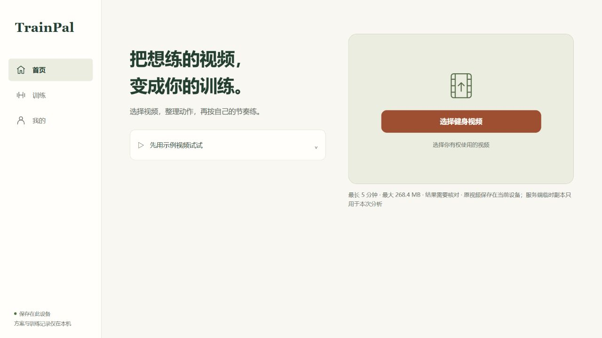

# TrainPal

### 把想练的视频，变成你的训练。

收藏了一条健身视频，真要练时，还得反复拖进度条找动作、记组数、算休息。TrainPal 帮你把这些内容整理成可编辑的训练方案，保留原视频出处，再由小猫教练陪你完成训练。

[使用流程](#从一个视频开始) · [本地运行](#本地运行) · [新版进展](#这一轮在做什么) · [反馈问题](https://github.com/LittleNuB/TrainPal/issues)



*2026-09-18 本地开发版实拍，无用户媒体。新版界面仍在整合，克隆 `main` 得到的版本会有所不同。*

## 从一个视频开始

1. **选一条想练的视频。** 从设备导入自己有权使用的文件，预览后再开始分析。
2. **核对动作和出处。** 查看识别出的动作，点回原片段；有疑问的动作会留待确认，没有分析到的范围会明确显示。
3. **把方案改到适合自己。** 调整顺序、组数、次数或时长，以及组间休息。保存的方案可以下次再练。
4. **开始训练，留下记录。** 观看动作参考，按组执行。次数型动作由你确认完成，时长型动作使用计时器；结束后保留实际完成量。

## 现在可以用什么

默认分支 `main` 包含本地视频导入、真实分析接口、方案编辑与手动保存、GYMTI 问卷和教练风格选择，以及训练、恢复、记录与分享海报。

真实分析需要配置内容理解服务。未配置时，可以使用明确标注的快速体验方案查看训练流程；分析失败不会返回一份假结果。当前不提供公开在线演示入口。

| 使用时关心的事 | TrainPal 的处理方式 |
| --- | --- |
| AI 认错了动作怎么办 | 回看来源片段，修改名称与参数；待确认项默认不进入训练 |
| 视频没讲次数怎么办 | 用可修改的规则默认值补齐，并与视频原意区分 |
| 只分析出一部分怎么办 | 保留可靠结果，显示缺口，允许针对缺口重试 |
| 中途退出怎么办 | 在同一设备找回未完成训练，结束时只记实际完成量 |

## 这一轮在做什么

最新一轮聚焦**对着视频练，少碰手机**。以下升级尚未合并到 `main`，本地验证通过也不代表已经发布。

| 升级 | 进展与入口 |
| --- | --- |
| 根据个人情况调整组次、时长和休息，保护手动修改 | [Draft PR #19](https://github.com/LittleNuB/TrainPal/pull/19) |
| 训练方案自动存档，切换或复制时保留原方案 | [Draft PR #20](https://github.com/LittleNuB/TrainPal/pull/20) |
| 循环观看当前片段、准备倒数、同动作组间自动衔接 | 本地实现，待体验验收 · [#22](https://github.com/LittleNuB/TrainPal/issues/22) |
| 留住视频里的训练要点，合并同一示范的重复结果并标出冲突 | 本地实现，待体验验收 · [#23](https://github.com/LittleNuB/TrainPal/issues/23) |
| 用文字或单次语音调整观看片段，先预览再确认继续 | 本地实现，待体验验收 · [#24](https://github.com/LittleNuB/TrainPal/issues/24) |

[查看本轮规格与验收进展 →](https://github.com/LittleNuB/TrainPal/issues/21)

## AI 负责理解，训练按规则执行

内容理解服务结合语音和视频画面，输出带时间范围的动作证据。训练编译把证据整理成基础方案，保留视频要求与规则补全的区别。进入训练后，计时、休息与完成记录由确定性执行器管理，小猫教练不直接控制训练进度。

“覆盖完整”只说明整段视频经过检查，仍可能有漏识别、错名或时间定位误差。仓库不承诺固定识别准确率或分析耗时，也不提供实时姿态纠正、伤病诊断或个体负重处方。

## 本地运行

准备 Node.js 24、pnpm 11、Python 3.12 和 [uv](https://docs.astral.sh/uv/)。

```powershell
git clone https://github.com/LittleNuB/TrainPal.git
Set-Location TrainPal
pnpm install
uv sync --project services/analysis-api
Copy-Item .env.example .env.local
pnpm dev
```

打开 `http://localhost:5173`。前端为 Vue，分析服务为 FastAPI。

要运行真实分析，请在 `.env.local` 配置 `ARK_API_KEY`、`VOLC_ASR_API_KEY` 与对应模型，并按运行环境准备 FFmpeg。可用配置见 [.env.example](.env.example)。密钥仅供后端读取，不要放进前端代码或提交到 Git。

示例配置将视频时长限制为 300 秒，文件大小限制为 256 MiB。实际可用上限以运行服务返回的能力为准；超过上限需先自行裁剪，受控示例视频也需单独配置媒体清单。

## 视频和训练数据放在哪里

原视频与训练数据保存在当前浏览器所在设备，暂不支持跨设备同步。点击分析后，服务端会处理临时媒体副本，并将分析所需内容交给已配置的服务商；原视频留在本机不等于分析全程离线。

服务端临时副本、音频、抽帧、转写与模型原文会在运行结束或取消后清理，不进入训练档案。你可以清除本机训练数据；清理浏览器存储也可能使方案和原视频不可恢复。产品不抓取任意视频链接，不读取平台 Cookie 或登录态。

## 开发与验证

```powershell
pnpm check
pnpm test:e2e
```

`pnpm check` 包含静态检查、单元测试与构建。端到端测试使用合成媒体和测试专用适配器，不代表真实模型的识别质量。真实 Provider 测试需另行配置，只保留脱敏结果；私人测试视频和凭据不随仓库分发。

| 目录 | 内容 |
| --- | --- |
| `apps/web/` | 页面、方案编辑与训练执行 |
| `services/analysis-api/` | 视频分析服务与 Provider 接口 |
| `contracts/`、`skills/` | 接口合同、问卷与训练领域能力 |
| `docs/adr/`、`docs/design/` | 产品决策与体验设计 |

继续阅读[领域词汇表](CONTEXT.md)、[本地视频与可恢复分析](docs/adr/0013-local-video-import-and-recoverable-analysis.md)、[覆盖状态约定](docs/adr/0025-provider-declares-complete-partial-or-insufficient-coverage.md)。历史竞赛文档保留作追溯，不能据此判断当前公网可用性。

## License

[MIT](LICENSE) © 2026 Hachimi Contributors
