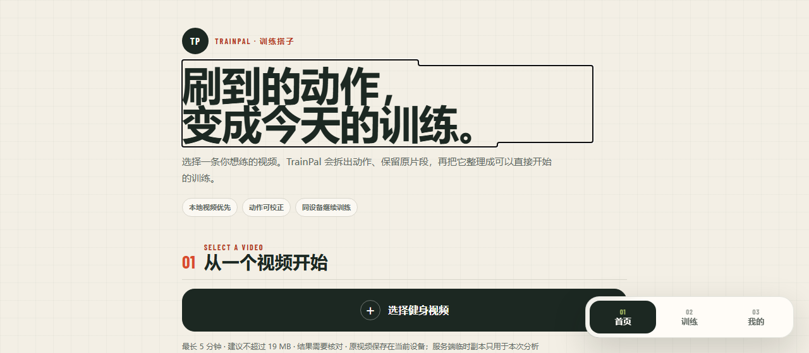
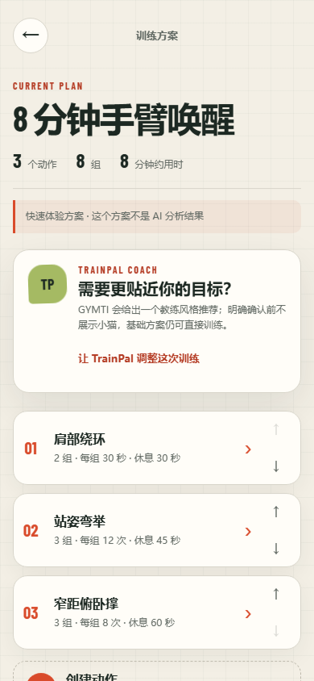
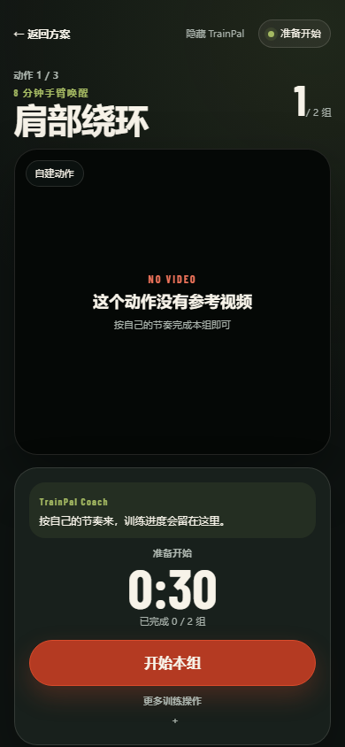

<h1 align="center">TrainPal</h1>

<p align="center"><strong>把一条本地健身视频，变成可核对、可编辑、能直接开始的训练。</strong></p>

<p align="center">
  
  
  
  
</p>

<p align="center">
  <a href="#本地运行">本地运行</a>
  · <a href="#一次训练怎样开始">使用流程</a>
  · <a href="#数据与媒体边界">数据边界</a>
  · <a href="#验证">验证</a>
</p>

<p align="center">
  
</p>

TrainPal 会检查整段视频，整理动作和对应时间，再把有疑问的地方留给人确认。用户可以改动作、顺序和参数，随后带着同一位小猫教练完成训练。

| 先看完整来源 | 再确认训练内容 | 最后记录真实结果 |
| --- | --- | --- |
| 显示分析阶段、覆盖范围与缺口 | 动作保留来源时间，待确认项默认排除 | 次数型动作手动确认，时长型动作使用计时器 |
| 分析可以完整、部分完成或证据不足 | 名称、顺序、组次、时长和休息都能修改 | 只保存实际完成量，并生成本机记录与海报 |

## 从视频到训练

<p align="center">
  <strong>选择本地视频</strong> →
  <strong>查看分析覆盖</strong> →
  <strong>确认动作</strong> →
  <strong>编辑方案</strong> →
  <strong>开始训练</strong> →
  <strong>保存记录</strong>
</p>

<table>
  <tr>
    <td width="50%" align="center"></td>
    <td width="50%" align="center"></td>
  </tr>
  <tr>
    <td align="center"><sub>确认动作，调整组次、时长、休息与顺序</sub></td>
    <td align="center"><sub>按组完成训练，只记录实际完成量</sub></td>
  </tr>
</table>

<p align="center"><sub>方案与训练画面使用仓库内置快速体验方案，只用于演示训练流程，不作为 AI 分析结果，也不包含真实用户数据。</sub></p>

公开仓库已经串起完整 Web 应用、分析服务、训练流程与验证合同。运行真实云端分析仍需要自行配置 Provider。服务不可用时，浏览与训练路径会保留，界面也会说明本次分析没有完成。

## AI 怎样参与

内容理解 Provider 先把视频整理成带来源时间的结构化结果。它必须声明本次覆盖是完整、部分或证据不足。完整只表示检查范围覆盖了整个来源，不代表每个动作判断都绝对正确；部分结果会列出缺口，可靠动作仍然可以继续使用；证据不足时，用户可以重试或手工创建动作。

训练编译随后把可靠动作排成一份可编辑的基础方案。缺失参数由版本化规则补齐，模型不能临场猜测重量，也不能替用户保存方案。个性化调整只有在用户主动触发后才运行，返回的改动仍要由用户确认。

动作要点会标出依据。视频里明确说过的内容标成来自视频，联网搜索结果保留可点击引用，只有模型世界知识时会写成 TrainPal 通用建议。没有可靠内容也是合法结果。

## 一次训练怎样开始

1. 从当前设备选择 MP4、MOV 或 WebM 文件，先在浏览器里预览。
2. 明确点击开始分析。页面会展示真实处理阶段、已经覆盖的来源时间和暂时发现的动作数量。
3. 分析完成后进入方案。可靠动作按来源顺序排列，待确认动作会原位保留但默认排除。
4. 修改动作、组数、次数或时长、休息与顺序。用户手动修改的值优先级最高。
5. 开始训练。次数型动作由用户确认完成，时长型动作使用计时器；刷新或离开页面后，可以在同一设备恢复未完成训练。
6. 训练结束后只保存实际完成量，并生成本机训练记录与分享海报。

## 当前做到哪里

- 首页、本地视频导入、可恢复分析、方案编辑、个性化问卷、训练执行、结果与海报已经串成一条 Web 流程。
- 用户选择的原视频保存在当前设备。服务端只处理一次运行所需的临时副本，并在成功、部分完成、取消或失败后清理。
- 竞赛部署合同验证过完整来源不超过 300 秒的能力。更长原片需要先在应用外裁剪，仓库没有把 10 分钟产品目标写成当前能力。
- 受控演示来源可以快速走通真实分析。它们来自明确清单，也不会回放缓存结果冒充新运行。
- 训练数据保存在同一设备。当前版本不承诺跨设备媒体与训练记录同步。

云端分析需要真实 Provider、媒体工具和部署配置。没有配置时，首页仍能展示产品路径，快速体验方案也会明确标注来源。运行时不会偷偷切到假分析结果。

## 人保留哪些决定

用户可以修改动作名称、顺序、训练方式、组数、次数或时长、休息、重量与参考时间段，也可以新增或删除动作。TrainPal 只拦住无法执行的结构错误，不会把建议范围变成用户输入上限。

训练中的即时调整来自确定性规则，只能影响当前动作剩余的休息、次数、时长或组数。它不会自动加重量，也不会改动其他动作。每项建议都要经过用户确认。

TrainPal 不提供疼痛诊断、伤病康复、负重处方或实时姿态判断。用户报告疼痛或眩晕时，产品只会提示停止训练并寻求专业帮助。

## 数据与媒体边界

- 本地视频只由用户主动选择，仓库不抓取任意链接，也不读取平台 Cookie 或登录态。
- 浏览器可以在当前设备保存来源媒体，服务端副本、音频、帧、转写和模型返回属于临时运行材料。
- 内容理解结果不保存原始转录、提示词或模型原文。
- 日志只记录运行阶段、耗时、版本与经过删减的错误类别。
- 用户可以清除当前设备上的训练数据与个性化信息。

## 本地运行

需要 Node.js 24、pnpm 11、Python 3.12 和 [uv](https://docs.astral.sh/uv/)。

```powershell
git clone https://github.com/LittleNuB/TrainPal.git
Set-Location TrainPal
pnpm install
uv sync --project services/analysis-api
Copy-Item .env.example .env.local
pnpm dev
```

打开 `http://localhost:5173`。`.env.local` 只由后端读取，必须留在 Git 忽略列表里。不要把密钥、令牌、Cookie 或真实用户视频提交到仓库。

默认配置只是开发起点，文件大小、来源时长与 Provider 可用性以运行时能力接口为准。

## 验证

```powershell
pnpm check
pnpm test:e2e
pnpm api:generate
```

- `pnpm check` 会运行 Web lint、类型检查、API 静态检查、单元测试与生产构建。
- `pnpm test:e2e` 使用独立 loopback 端口、合成媒体和测试专用适配器，不复用正在运行的本地服务。
- `pnpm smoke:cloud` 只有在本地显式配置真实云端能力后才运行，CI 不注入云端密钥。

## 代码导览

```text
apps/web/                  Vue 前端与完整训练旅程
services/analysis-api/     FastAPI 分析服务
contracts/                 版本化接口与问卷合同
skills/                    训练编译、个性化与动作要点领域能力
docs/design/               体验与视觉设计说明
docs/adr/                  产品与架构决策记录
```

`questionaire/` 是队友提交的独立参考原型，只用于设计与实现追溯。正式产品入口位于 `apps/web` 与 `services/analysis-api`，参考原型不会进入线上源码包或服务。

## 继续了解

- [移动端体验 Brief](docs/design/trainpal-mobile-experience-brief.md)
- [竞赛 Web MVP 规格](docs/specs/competition-web-mvp.md)
- [领域词汇表](CONTEXT.md)
- [本地视频导入与可恢复分析 ADR](docs/adr/0013-local-video-import-and-recoverable-analysis.md)
- [内容理解覆盖状态 ADR](docs/adr/0025-provider-declares-complete-partial-or-insufficient-coverage.md)
- [TrainPal 编排三个领域 Skill ADR](docs/adr/0018-trainpal-orchestrates-base-compilation-and-optional-personalization.md)

## License

[MIT](LICENSE) © 2026 Hachimi Contributors
